# Logic Circuit Boards ⚡
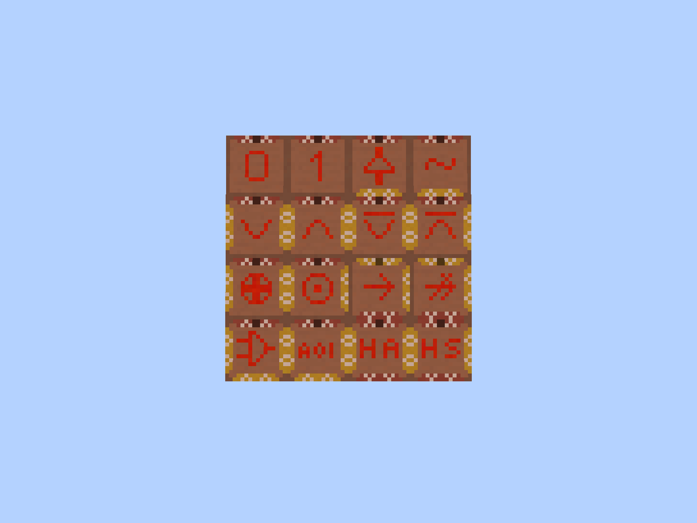

## About
Compress your redstone logic gates to single-block printed circuit boards. This mod allows you to construct redstone
circuits on top of an 8 by 8 square of breadboard blocks which is then used to generate a circuit block, which performs
the same boolean function as your original circuit. The mod is usable in both survival and creative.

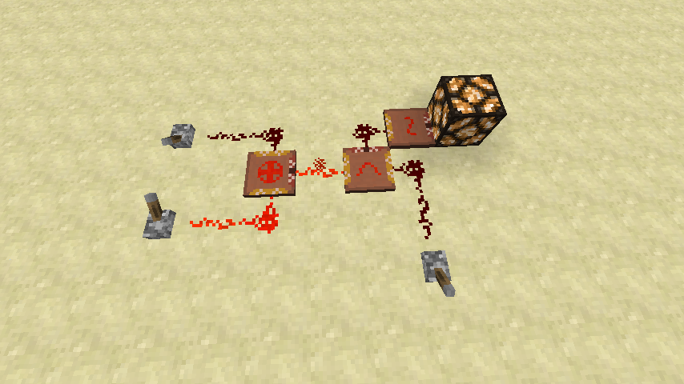

## Installation
Drop the `.jar` file into your `mods` folder.

## Features
### Breadboard
The breadboard block is cheap to make, can't be moved by pistons, and doesn't conduct redstone. Use a stack of
breadboard blocks to build a flat square with a side length of 8. The created area acts as a playground, on top of
which you can build a logic gate using redstone, redstone torches, and other circuits.

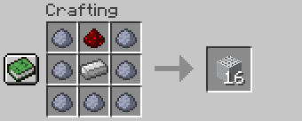
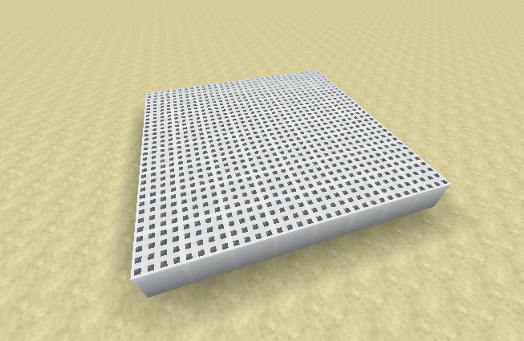

### Screwdriver and breadboard configuration
Craft a screwdriver and use it on a correctly-constructed breadboard to configure it. Each of the four sides can act as
an input or output. Changing the side type turns 6 of the breadboard blocks into input or output variants. Redstone
wires placed directly above those blocks connect with them and can receive power from those blocks.

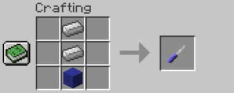
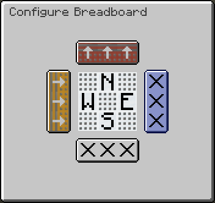
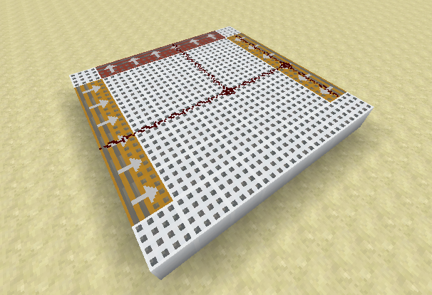

### Multimeter and circuit creation
Once you've configured your breadboard and successfully built a redstone circuit on top you can get the corresponding
circuit block using a multimeter. Circuit generation is free in creative mode but costs some terracotta blocks (any
color), redstone dust, and redstone torches in survival. You can give a custom name to a circuit. Your inputs and
outputs will be oriented such that the circuit's front corresponds with the north side of the breadboard.

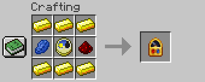
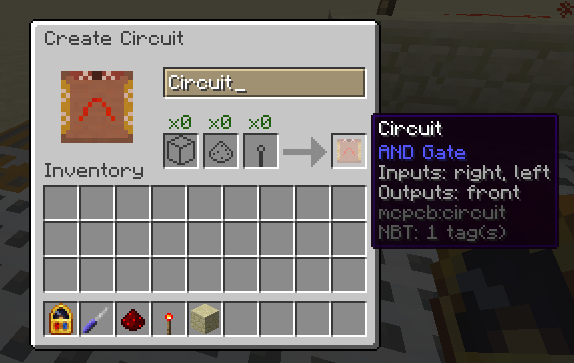
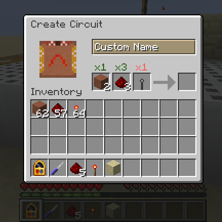

The circuits are classified only according to the boolean function they represent, which means that for instance the
two following breadboards will generate the same, exact, stackable circuit block:

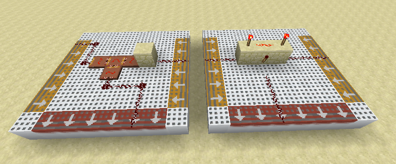

You can also use the multimeter on a circuit block to replicate an existing circuit.

### Circuit usage
The generated circuit can be integrated into any of your redstone contraptions or used to create more advanced
circuits. The most common boolean functions have a custom top-face texture to make it easy to distinguish them. There
is a small dot located on the front side of the circuit. It makes it easy to locate particular sides of the breadboard
in case its inputs or outputs might be ambiguous. The sides are also color coded. Yellow sides act as inputs, while
red sides are outputs (there are also small arrows to distinguish them). The outputs provide strong power (meaning
that they can power redstone through a block) and the inputs can receive power through a solid block. All of the
circuits have a delay of one tick (to reduce lag in large redstone builds). To provide additional delay place a
repeater behind the output.

### Advancements
The mod defines numerous advancements that act as a lightweight tutorial. The advancement system also guarantees that
you always have recipes required to unlock the next advancement in a tree.

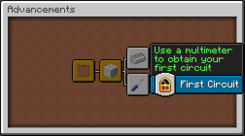
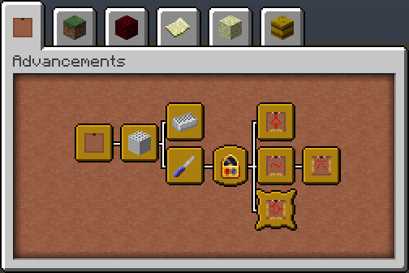

One of the advancements requires you to discover all of the built-in recognized circuit types:
- Constant logical false signal (0)
- Constant logical true signal (1)
- Digital buffer (a one-way diode)
- OR gate (2 or 3 inputs)
- Inverter (NOT gate)
- NOR gate (2 or 3 inputs)
- AND gate (2 or 3 inputs)
- NAND gate (2 or 3 inputs)
- XOR gate
- XNOR gate
- IMPLY gate
- NIMPLY gate
- Half adder
- Half subtractor
- Multiplexer (2 to 1)
- AND-OR-Invert (2-1)

### Creative mode support
The mod includes an additional creative tab containing some prebuilt circuits. Note that it doesn't include any gates
which have ambiguous input/output configuration (for example half adder) or unpopular logic gates, however,
implementing them using the included circuits should be trivial.

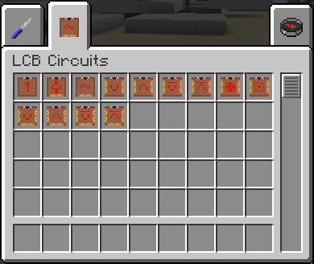

## Limitations
The circuit synthesis mechanism contains some limitations, namely:
- Only circuits implementing combinational logic (circuit's outputs are pure functions of the inputs) are allowed.
  Thus the circuit cannot hold any state, and creating things such as clocks or flip-flops isn't possible.
- The circuit can only use redstone wires, redstone torches, other circuits, and normal blocks. Specifically, pistons
  and redstone repeaters are not allowed. Two redstone wires connected by a repeater will be treated as fully
  disconnected during circuit generation. If you need to propagate power in one way only consider using a digital
  buffer gate (a diode) which can be created by making a circuit with one input and one output, and directly connecting
  them with redstone dust. It is worth noting, that wires and torches alone can be used to create a NAND or NOR gate,
  which is functionally complete, which means that you can implement any boolean function using only those blocks.
  Thus any boolean function (containing at most 4 inputs and outputs) can be created with this mod.
